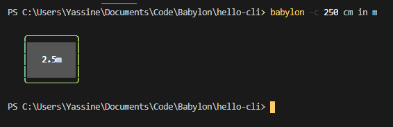

# Babylon-CLI

## This is a Command Line Interface to convert between SI units of length, currently only units of mm, cm, and m are supported.

To build this code on your machine:
1. Clone this repository onto your local machine.
1. Ensure you have node.js and npm installed, if not you can download them from [here](https://nodejs.org/en/)
1. `cd` into the babylon-cli directory.
1. Run `npm install -g .` (the dot is important), this will install the package on your machine globally - allowing it to be accessed from anywhere within the terminal.
1. Type `babylon` followed by `-c "<number> <unit1> in <unit2>"` for example `babylon -c "50 cm in m"` and then hit enter, please note the double quotations that indicate a string.
1. You should expect the CLI to print output to the terminal of the form `<number> <unit>` for example `0.5m`.
1. To run all tests type `npm run test` into the terminal and to view test coverage type `npm test -- --coverage"`, note that you should be withing the babylon-CLI directory when you do this.

Here is the CLI in action.
